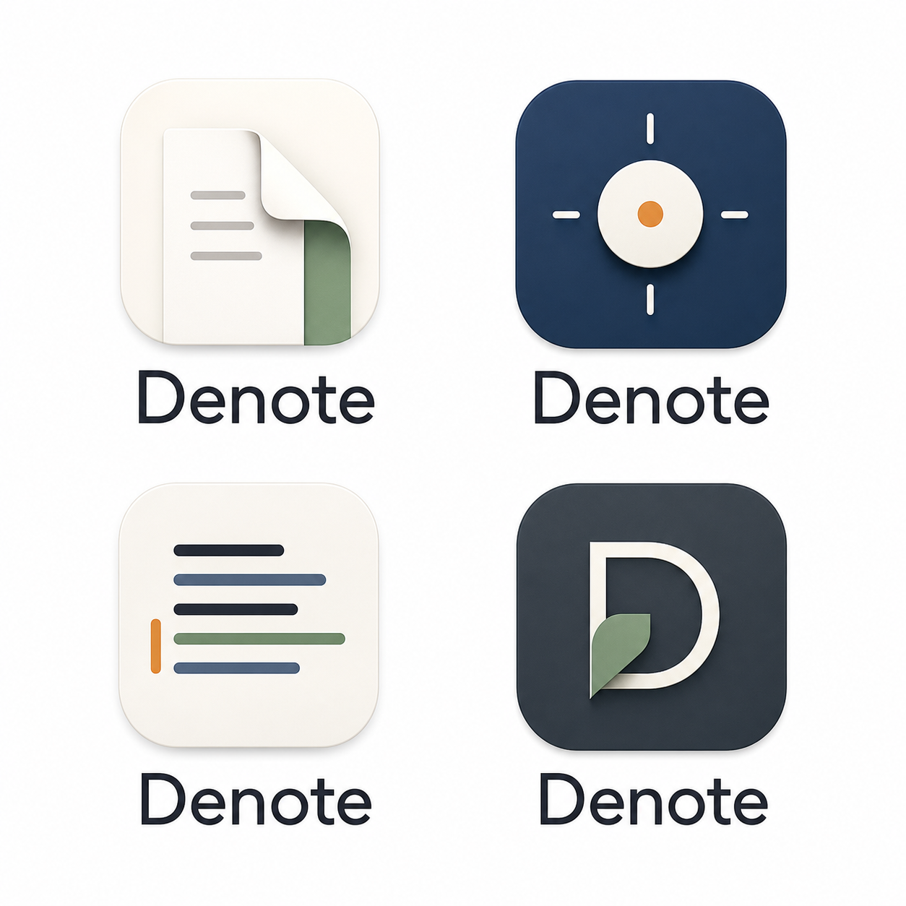

# Denote

Denote is a small native macOS notes app for quick rich-text notes. It opens directly into editable note windows, autosaves each note as a local document, and restores open notes when relaunched.

## Logo Options



Notes are saved in:

```text
~/Documents/Denote
```

App window state is saved in:

```text
~/Library/Application Support/Denote/state.json
```

## Features

- Native macOS app with compact titlebar toolbar.
- Rich-text editing backed by ProseMirror.
- Autosave for every open note.
- Restart restore for open note windows.
- Standard and small window presets.
- Always-hover pin toggle per window.
- TextEdit-style title rename popover from the titlebar chevron.
- Random readable note names used in `.note.json` filenames.
- Rich paste support for tables, merged cells, lists, and browser-rendered formatting.
- Export to Markdown, plain text, or HTML.
- Formatting shortcuts: `Cmd-B`, `Cmd-I`, `Cmd-1`, `Cmd-2`, `Cmd-3`, and `Cmd-0`.
- Backslash heading triggers: `\ `, `\\ `, and `\\\ ` for heading levels 1-3.

## Requirements

- macOS 14 or later.
- Xcode command line tools with Swift.
- Node.js and npm.

Install the Xcode command line tools if needed:

```sh
xcode-select --install
```

## Download

Clone the repository:

```sh
cd ~/Downloads
git clone https://github.com/olliepumphrey7/denote.git
cd denote
```

## Install

Install JavaScript dependencies, build the editor bundle, build the macOS app, and copy it into `/Applications`:

```sh
npm install
npm run build:editor
./scripts/install-app.sh
```

If `/Applications` is not writable, the installer copies the app into `~/Applications` instead.

Open the installed app:

```sh
open -a "Denote"
```

If macOS warns that the app is from an unidentified developer, open System Settings, go to Privacy & Security, and allow the app to open. This project currently builds a local unsigned app.

## Update

Pull the latest code and reinstall:

```sh
cd ~/Downloads/denote
git pull
npm install
npm run build:editor
./scripts/install-app.sh
```

Quit and reopen Denote after updating.

## Development

Build and run from the repository:

```sh
npm install
npm run build:editor
swift build
swift run DenoteChecks
npm run test:editor
./scripts/build-app.sh
open "dist/Denote.app"
```

## Notes Format

Each note is stored as a `.note.json` file in `~/Documents/Denote`. The file contains the editor document model, rendered HTML, and plain text fallback. These files are local and are not synced by the app itself.
